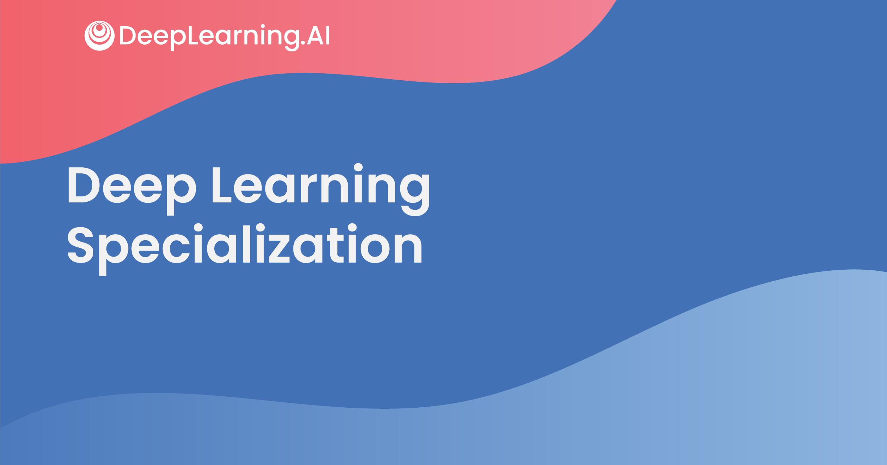
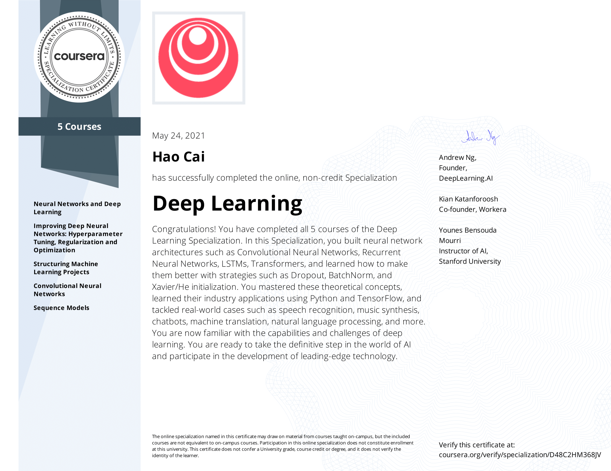

# Deep-Learning-Specialization
This repository contains all course notes, quizzes, and programming assignments for Coursera MOOC [Deep Learning Specialization](https://www.coursera.org/specializations/deep-learning), provided by DeepLearning.AI.

## About this specialization
The Deep Learning Specialization is a foundational program that will help you understand the capabilities, challenges, and consequences of deep learning and prepare you to participate in the development of leading-edge AI technology. 

In this Specialization, you will build and train neural network architectures such as Convolutional Neural Networks, Recurrent Neural Networks, LSTMs, Transformers, and learn how to make them better with strategies such as Dropout, BatchNorm, Xavier/He initialization, and more. Get ready to master theoretical concepts and their industry applications using Python and TensorFlow and tackle real-world cases such as speech recognition, music synthesis, chatbots, machine translation, natural language processing, and more.

AI is transforming many industries. The Deep Learning Specialization provides a pathway for you to take the definitive step in the world of AI by helping you gain the knowledge and skills to level up your career. Along the way, you will also get career advice from deep learning experts from industry and academia.

## Applied Learning Project
By the end you’ll be able to

 • Build and train deep neural networks, implement vectorized neural networks, identify architecture parameters, and apply DL to your applications

• Use best practices to train and develop test sets and analyze bias/variance for building DL applications, use standard NN techniques, apply optimization algorithms, and implement a neural network in TensorFlow

• Use strategies for reducing errors in ML systems, understand complex ML settings, and apply end-to-end, transfer, and multi-task learning

• Build a Convolutional Neural Network, apply it to visual detection and recognition tasks, use neural style transfer to generate art, and apply these algorithms to image, video, and other 2D/3D data

• Build and train Recurrent Neural Networks and its variants (GRUs, LSTMs), apply RNNs to character-level language modeling, work with NLP and Word Embeddings, and use HuggingFace tokenizers and transformers to perform Named Entity Recognition and Question Answering

## Timeline

* **Date Started**: Apr 26, 2021

* **Date Completed**: Jun 14, 2021

## Certificate

## Notes, Quizzes and Lab assignments

### Course 1: Neural Networks and Deep Learning
- Week 1: Introduction to Deep Learning - [notes, quizzes and assignments](https://github.com/haocai1992/Deep-Learning-Specialization/tree/main/C1-Neural-Networks-and-Deep-Learning/Week%201:%20Introduction%20to%20Deep%20Learning)
- Week 2: Neural Networks Basics - [notes, quizzes and assignments](https://github.com/haocai1992/Deep-Learning-Specialization/tree/main/C1-Neural-Networks-and-Deep-Learning/Week%202:%20Neural%20Networks%20Basics)
- Week 3: Shallow Neural Networks - [notes, quizzes and assignments](https://github.com/haocai1992/Deep-Learning-Specialization/tree/main/C1-Neural-Networks-and-Deep-Learning/Week%203:%20Shallow%20Neural%20Networks)
- Week 4: Deep Neural Networks - [notes, quizzes and assignments](https://github.com/haocai1992/Deep-Learning-Specialization/tree/main/C1-Neural-Networks-and-Deep-Learning/Week%204:%20Deep%20Neural%20Networks)
---
### Course 2: Improving Deep Neural Networks: Hyperparameter Tuning, Regularization and Optimization
- Week 1: Practical Aspects of Deep Learning - [notes, quizzes and assignments](https://github.com/haocai1992/Deep-Learning-Specialization/tree/main/C2-Improving-Deep-Neural-Networks-Hyperparameter-Tuning-Regularization-and-Optimization/Week%201:%20Practical%20Aspects%20of%20Deep%20Learning)
- Week 2: Optimization Algorithms - [notes, quizzes and assignments](https://github.com/haocai1992/Deep-Learning-Specialization/tree/main/C2-Improving-Deep-Neural-Networks-Hyperparameter-Tuning-Regularization-and-Optimization/Week%202:%20Optimization%20Algorithms)
- Week 3: Hyperparameter Tuning, Batch Normalization and Programming Frameworks - [notes, quizzes and assignments](https://github.com/haocai1992/Deep-Learning-Specialization/tree/main/C2-Improving-Deep-Neural-Networks-Hyperparameter-Tuning-Regularization-and-Optimization/Week%203:%20Hyperparameter%20Tuning%2C%20Batch%20Normalization%20and%20Programming%20Frameworks)
---
### Course 3: Structuring Machine Learning Projects
- Week 1: ML Strategy (1) - [notes, quizzes and assignments](https://github.com/haocai1992/Deep-Learning-Specialization/tree/main/C3-Structuring-Machine-Learning-Projects/Week%201:%20ML%20Strategy%20(1))
- Week 2: ML Strategy (2) - [notes, quizzes and assignments](https://github.com/haocai1992/Deep-Learning-Specialization/tree/main/C3-Structuring-Machine-Learning-Projects/Week%202:%20ML%20Strategy%20(2))
---
### Course 4: Convolutional Neural Networks
- Week 1: Foundations of Convolutional Neural Networks - [notes, quizzes and assignments](https://github.com/haocai1992/Deep-Learning-Specialization/tree/main/C4-Convolutional-Neural-Networks/Week%201:%20Foundations%20of%20Convolutional%20Neural%20Networks)
- Week 2: Deep Convolutional Models: Case Studies - [notes, quizzes and assignments](https://github.com/haocai1992/Deep-Learning-Specialization/tree/main/C4-Convolutional-Neural-Networks/Week%202:%20Deep%20Convolutional%20Models:%20Case%20Studies)
- Week 3: Object Detection - [notes, quizzes and assignments](https://github.com/haocai1992/Deep-Learning-Specialization/tree/main/C4-Convolutional-Neural-Networks/Week%203:%20Object%20Detection)
- Week 4: Special Applications: Face recognition & Neural Style Transfer - [notes, quizzes and assignments](https://github.com/haocai1992/Deep-Learning-Specialization/tree/main/C4-Convolutional-Neural-Networks/Week%204:%20Special%20Applications:%20Face%20recognition%20%26%20Neural%20Style%20Transfer)
---
### Course 5: Sequence Models
- Week 1: Recurrent Neural Networks - [notes, quizzes and assignments](https://github.com/haocai1992/Deep-Learning-Specialization/tree/main/C5-Sequence-Models/Week%201:%20Recurrent%20Neural%20Networks)
- Week 2: Natural Language Processing & Word Embeddings - [notes, quizzes and assignments](https://github.com/haocai1992/Deep-Learning-Specialization/tree/main/C5-Sequence-Models/Week%202:%20Natural%20Language%20Processing%20%26%20Word%20Embeddings)
- Week 3: Sequence Models & Attention Mechanism - [notes, quizzes and assignments](https://github.com/haocai1992/Deep-Learning-Specialization/tree/main/C5-Sequence-Models/Week%203:%20Sequence%20Models%20%26%20Attention%20Mechanism)
- Week 4: Transformer Network - [notes, quizzes and assignments](https://github.com/haocai1992/Deep-Learning-Specialization/tree/main/C5-Sequence-Models/Week%204:%20Transformer%20Network)

## Disclaimer
- Copyright of all materials in this repository belongs to DeepLearning.AI, and can only be used or distributed for educational purpose. You may not use or distribute them for commercial purposes.
- My quiz and assignment solutions are for reference only. Please do not copy any part of the code/answer directly.

